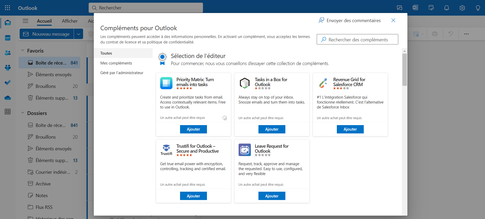
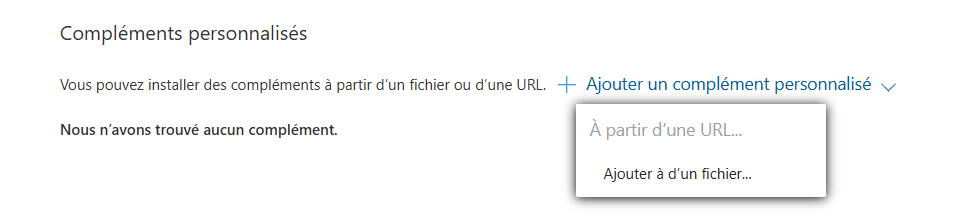
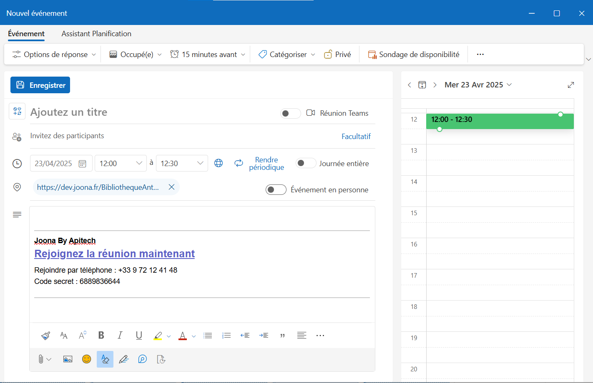

# 📅 Joona Meet - Outlook Add-in

# Description
**Joona Meet** est un Add-in pour Outlook  qui facilite l'organisation de réunions sur notre plateforme (https://joona.fr). Lors de la planification d'un événement via l'Outlook Planner, il génère automatiquement des liens de visioconférence Joona
Lorsque vous créez un nouvel événement dans votre calendrier Outlook. Plus besoin de copier-coller des liens manuellement, l'add-in s'occupe de tout pour vous.


Développé avec ⚙️ Webpack, 🐳 Docker, 🛜 NGINX et conçu pour être facilement déployé dans un environnement d'entreprise sécurisé.

---

## ✨ Fonctionnalités

- Génération de lien Jitsi automatique dans un rendez-vous Outlook
- Déploiement web-ready avec NGINX + Docker
- Configuration dynamique via variables d’environnement

---

## 🚀 Installation

###  Cloner le projet

```bash
git clone https://github.com/votre-org/joona-outlook-addin.git
cd joona-outlook-addin
```

###  Configurer l’environnement 
Copier le fichier .env.exemple et le remplir :

```bash
cp .env.exemple .env
```

Exemple :
```bash
PLUGIN_PORT=5000
ADDIN_BASE_URL=https://dev.joona.fr/plugin-outlook

```
### Configuration voxify
Copier le fichier example.vars.json et le remplir :

```bash
cp example.vars.json vars.json
```
Exemple :
```bash
{
  "DIALINNUMBER_URL": "https://example.com",
  "DIALINCONF_CODEURL": "https://example.com",
  "ENABLED_PHONE_ACCESS": "true",
  "JITSI_DOMAIN": "example.com",
  "PHONE_NUMBER_FORMAT": "%phone_number%",
  "ENABLE_MODERATOR_OPTIONS": "false",
  "TITLE_MEETING_DETAILS": "Exemple_test"
  "ROOM_NAME_PREFIX":" ",
  "ROOM_NAME_LENGTH":10
}

```
## Variables de configuration — Génération des noms de salle & accès téléphonique


---

**`DIALINNUMBER_URL`** (`string`)  
URL de l’API Voxify qui fournit le numéro de téléphone pour rejoindre une réunion par appel (dial-in).

---

**`DIALINCONF_CODEURL`** (`string`)  
URL de l’API Voxify qui fournit le **code de conférence** pour l’accès téléphonique.

---

**`ENABLED_PHONE_ACCESS`** (`boolean` — `"true"` / `"false"`)  
Active ou désactive l’accès à la réunion par téléphone.  
Si `false`, aucun numéro de téléphone ne sera proposé aux participants.

---

**`JITSI_DOMAIN`** (`string`)  
Domaine principal du serveur Jitsi utilisé pour générer les liens de conférence.  
Exemple : `joona.fr`

---

**`PHONE_NUMBER_FORMAT`** (`string`)  
Modèle pour formater l’affichage du numéro de téléphone.  
Peut contenir le placeholder `%phone_number%` pour insertion dynamique.  
Exemple : `+33 %phone_number%`

---

**`TITLE_MEETING_DETAILS`** (`string`)  
Titre affiché au-dessus des détails de la réunion (numéro dial-in, code de conférence, lien).

---

**`ROOM_NAME_PREFIX`** (`string`)  
Préfixe ajouté au nom de salle généré automatiquement.  
- `alea_name` : génère un nom structuré lisible, par exemple `ChapelleVictorHugoAnalyser-5HJTXDLuHD`  
- Texte personnalisé : préfixe fixe, par exemple `"Salle"`  
- Vide : génère un ID alphanumérique pur.  
Valeurs possibles : `"alea_name"`, `"Salle"` ou `""`.

---

**`ROOM_NAME_LENGTH`** (`number`)  
Longueur totale du nom de salle généré (préfixe + séparateur + suffixe).  
💡 Ignoré si `ROOM_NAME_PREFIX` vaut `alea_name`.  
Exemple : `10`


##   Build & Lancement avec Docker 🧱

```bash
docker compose up -d --build

```
L'application sera accessible sur :
```bash
🧩 http://localhost:${PLUGIN_PORT}
```

##  🧪 Développement local

```bash
npm install
npm run dev-server

```

## 🧩 Ajouter le complément dans Outlook

Si vous êtes utilisateur Outlook, vous devez suivre les étapes ci-dessous : (Si vous êtes administrateur Outlook et que vous souhaitez diffuser l'Add-in vers l'ensemble de vos utilisateurs, suivez les étapes  dans la section [section administrateur outlook](#administrateur-outlook).)
- Téléchargez le fichier **manifest.xml** de l'add-in, situé dans ce dépôt.
- Cliquez sur le lien "https://aka.ms/olksideload". Cela ouvre Outlook sur le Web, puis charge la  boîte de dialogue Compléments pour Outlook  après quelques secondes.

- Sélectionnez **Mes compléments**.
- Dans la section **Compléments personnalisés**, sélectionnez **Ajouter un complément personnalisé**, puis choisissez **Ajouter à d’un fichier**.

- Sélectionnez le fichier **manifest.xml**.
- Sélectionnez **Ouvrir** pour installer le module complémentaire.

## Administrateur Outlook 

## Microsoft 365
Si vous êtes administrateur Outlook sur Office 365. Il est recommandé de suivre la documentation de Microsoft et d'ajouter l'URL de l'add-in.
- Lien vers la documentation : [https://learn.microsoft.com/fr-fr/microsoft-365/admin/manage/manage-deployment-of-add-ins?view=o365-worldwide](https://learn.microsoft.com/fr-fr/microsoft-365/admin/manage/manage-deployment-of-add-ins?view=o365-worldwide)

### Exchange Server
Si vous êtes administrateur Outlook sur un serveur Exchange. Il est recommandé de suivre la documentation de Microsoft et d'ajouter l'URL de l'add-in.
 - Lien vers la documentation : [https://learn.microsoft.com/fr-fr/exchange/add-ins-for-outlook-2013-help](https://learn.microsoft.com/fr-fr/exchange/add-ins-for-outlook-2013-help)

# Utilisation

- Créez un nouvel événement dans votre agenda
- Dans la page de création de l'événement, cliquez sur le bouton "Joona Meet"
- Votre invitation devrait ressembler à la capture d'écran ci-dessous : 


# Supprimer l'Add-in

- Accédez à la barre de navigation et sélectionnez **L’icône Plus d’applications**. **Plus d'applications > Ajouter des applications**.
- Sur la page **Applications**, sélectionnez **Gérer vos applications**.
- Sous **Gérer vos applications**, recherchez l’application que vous souhaitez supprimer et sélectionnez **Plus d’options > Supprimer**.

# Contact

Pour toute demande d'assistance. Vous devez vous adresser à vos assistants informatiques de proximité.
S'ils ne parviennent pas à résoudre votre problème, ils peuvent nous écrire à cette adresse :
support@apitech.fr